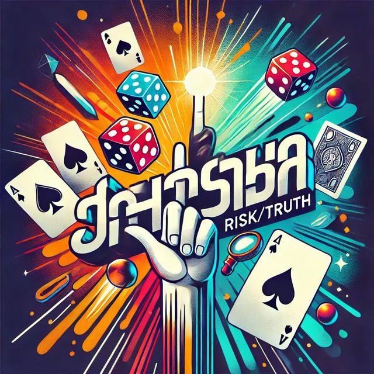
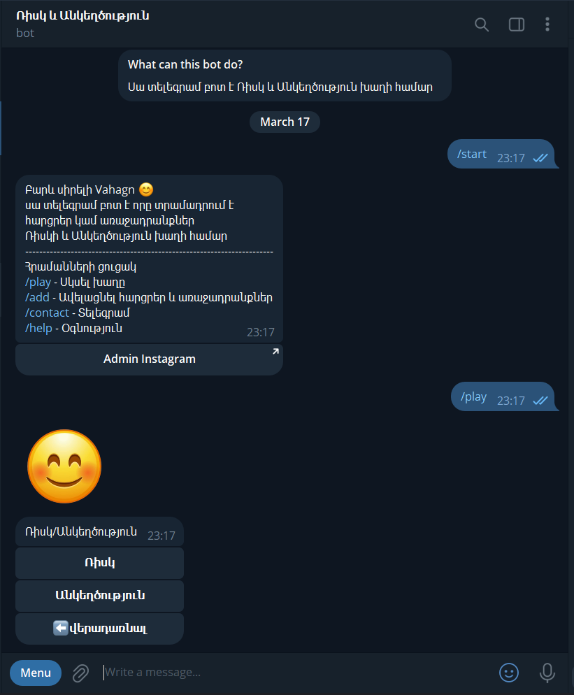

# Risk_Sincerity_bot
Risk_Sincerity_bot-ը Telegram բոտ է, որը հարցեր է տրամադրում «Ռիսկ և անկեղծություն» խաղի համար: Այն հնարավորություն ունի մուտքագրել մասնակիցների անունները և օգտագործել պատահական ընտրության տարբերակը: Կարող եք նաև խաղալ առանց մասնակիցների անունները մուտքագրելու՝ պարզապես օգտագործելով հարցերը: Կարող եք ավելացնել ձեր սեփական հարցերն ու առաջադրանքները:

Risk_Sincerity_bot is a Telegram bot that provides questions for the game Risk and Sincerity. It has the ability to enter the names of the participants and use the random selection option. You can also play without entering the names of the participants, simply using the questions.
You can also add any questions and tasks of your own.

https://t.me/Risk_Sincerity_bot

